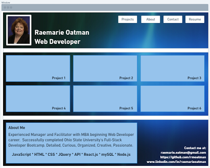
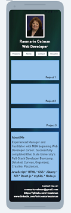
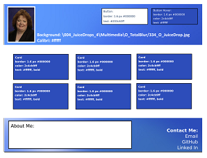
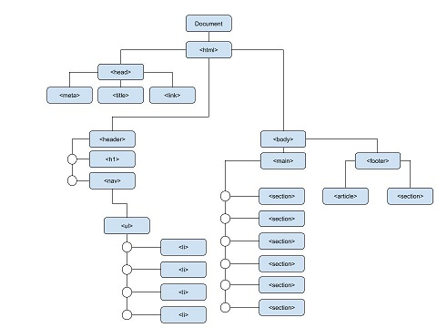

# RMOatman-Developer-Portfolio

https://rmoatman.github.io/RMOatman-Developer-Portfolio/

## Description
~~~
The intent of this project was to both gain experience developing a website and also to begin the process of creating a portfolio.

The portfolio will highlight my strongest work and the though processes behind it.  It should include a photo or avatar, navigation links, project cards with headers, an about me section, and a contact me section.  Currently, all the project cards are placeholders that represent potential future projects.  This section will be updated as I continue to learn more.

The core skills demonstrated in this project include flexbox, media queries, and CSS variables.  When the portfolio is loaded, the navigation links should work correctly, the initial project should be represented by a larger size image, and the layout should adopt to various sizes and viewports.
~~~

## Application
~~~
I spent several hours planning the project prior to coding.  I created them to help me visualize what I wanted the page would look like in both a desktop and a mobile viewport.  I created a DOM tree, several wireframes, and a styleguide.  More information about these documents can be found below.

The final result resembles the initial plan in many aspects.  I made several changes however.  These changes were a result of time constraints and limited knowledge.  I made a few appearance changes, as well.  For instance:

- I initially had planned to use an image for the background.  The image I chose resulted in a tiling effect in different viewports.  I didn't care for the look, so I chose a gradient, instead.  This resulted in a constant background throughout the main and footer sections.

- I had to make changes to the DOM tree.  I added several div elements to assist with the desired flex functionality.  I also added a elements which should have been included initially.

- The project cards are not displayed as initially intended.  I would have preferred the large project card to be on the left with the thumbnails on the right.  Unfortunately, my limited knowledge and the finite time constraints resulted in my changing my approach to both finish on time and meet the acceptance criteria of one larger image.  As is, the project card layout looks clean and is responsive to different viewports.
~~~

## Reflection
~~~
As mentioned above, the intent of this project was to gain experience developing a website from scratch using the skills learned thus far.  It also allowed practice commenting to a repository, adding and deleting files and folders from a repository, researching various topics (useful planning documents, CSS variables, flexbox, and gradients).  My takeaways include:
-   The importance of taking time to plan the website from different points of view
-   Experience creating and using a DOM Tree, Wireframe, and Style guide (and the applications used to create them)
-   The need to manage time thoughtfully and set limits to time spent on research and revisions
-   Experience using flex properties and an anticipation to learn about CSS grid
-   Ideas for future projects
~~~

## About the Planning Docs (see end of document)
~~~
PORTFOLIO_WIREFRAME and PORTFOLIO_RESPONSIVE_WIREFRAME
https://github.com/rmoatman/RMOatman-Developer-Portfolio/blob/main/planningdocs/Portfolio_WireFrame.PNG
https://github.com/rmoatman/RMOatman-Developer-Portfolio/blob/main/planningdocs/Portfolio_Responsive_WireFrame.PNG

These documents were created using tools found at https://whimsical.com/.  Some differences between the wireframes and the actual page include a simpler background in order to place more focus on the content.  Also, I moved the photo to the footer to allow for navigation that remains at the top of the page regardless of user scrolling.  I didn't feel that keeping the image at the top of the page added any value to the user experience.

PORTFOLIO_STYLE_GUIDE
https://github.com/rmoatman/RMOatman-Developer-Portfolio/blob/main/planningdocs/Portfolio_Style_Guide.png

This document was created using Inkscape (https://inkscape.org).  I created this page to help me to create a color/font theme.  It also helped to identify styles that will be applied to many elements and those that will be unique to certain elements.

PORTFOLIO_DOM_TREE
https://github.com/rmoatman/RMOatman-Developer-Portfolio/blob/main/planningdocs/Portfolio_DOM_Tree.jpg

This document is a Google Docs Drawing.  It was very useful in organizing the page and planning how I would use semantic elements.  It differs from the actual portfolio page.  Initially, the <footer> contained an About Me<article> and a Contact Me<section>.  As I thought about responsiveness, however, I decided that the <footer> would be better organized and styled with the elements  <article> and a <section> with a <ul> instead.
~~~

## Licenses and Attributions
~~~
- CSS Reset source: normalize.css v8.0.1 | MIT License | github.com/necolas/normalize.css
- Medication.jpg, Weather.jpg, and Ingredients.jpg, source: Digital Juice 2.0 DVD Collection published by https://DigitalJuice.com copyright 2003 Digital Juice, Inc.
- Taxes-by-pexels-nataliya-vaitkevich-6863184.jpg and Ebooks-by-pexels-perfecto-capucine-1329571.jpg source:  https://Pexels.com.  Images contributed by Nataliya Vaitkevich.
~~~

## Contact Information
~~~
- Raemarie Oatman
- raemarie.oatman@gmail.com
- https://www.linkedin.com/in/raemarieoatman
- https://github.com/rmoatman
~~~

## Planning Documents
PORTFOLIO_WIREFRAME

PORTFOLIO_RESPONSIVE_WIREFRAME

PORTFOLIO STYLE GUIDE

PORTFOLIO DOM TREE

# RMOatman_Portfolio
# RMOatman_Portfolio
# RMOatman_Developer_Portfolio
# RMOatman_Developer_Portfolio
